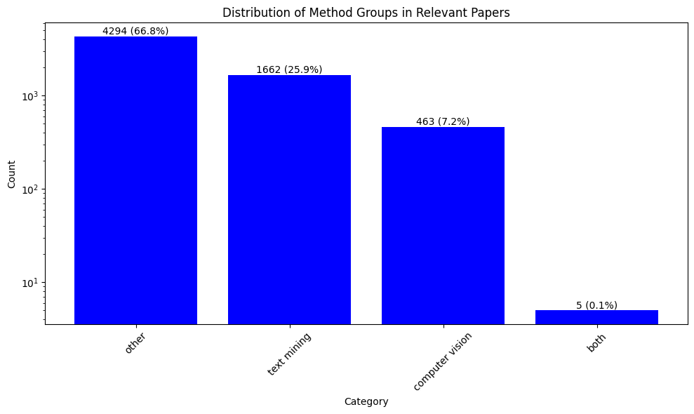

# Semantic NLP Filtering for Deep Learning Papers in Virology/Epidemiology

# Approach
## NLP technique

In the filtering process for relevant papers, I employed a combination of Natural Language Processing (NLP) techniques, primarily leveraging embedding models—specifically, **DistilBERT**—to represent the textual content of the papers in a dense vector space. This approach allows us to capture semantic meanings and contextual relationships within the text, going beyond mere keyword matching. Additionally, we utilized lemmatization to standardize the terms used in the papers, reducing variations in word forms (e.g., "analyze" vs. "analyzing") and improving the effectiveness of the filtering.

## Advantages of this approach over keywords-based filtering
The use of embedding models like DistilBERT offers some advantages over keyword-based filtering:
- Semantic Understanding: Unlike keyword matching, which only checks for the presence of specific words or phrases, embedding models understand the context and meaning of words. This allows for the identification of relevant papers that may not contain the exact keywords but are still related semantically.

- Handling Variability: Keywords-based filtering can miss relevant papers due to variations in terminology, spelling, or word forms. By utilizing embeddings, we can account for synonyms and related terms, making our filtering process more robust.

- Dimensionality Reduction: By converting textual data into vector representations, we can apply techniques like cosine similarity to measure the relevance of papers based on the content's overall context rather than isolated terms.

# Results
sdsdsd

 

 

# Conclusion

