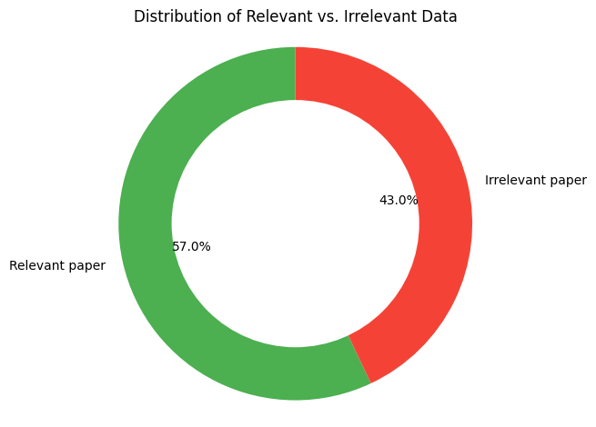
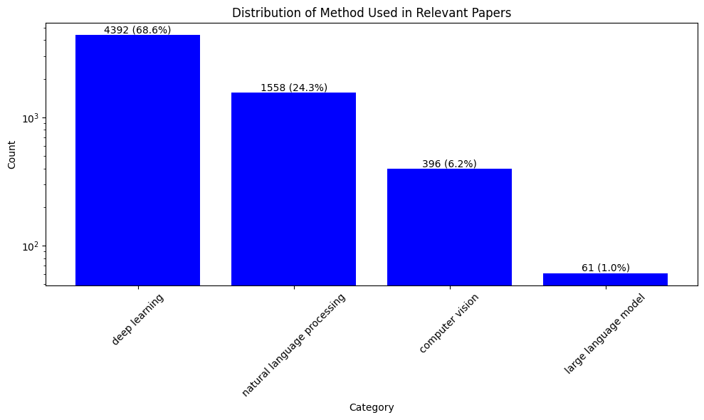

# Semantic NLP Filtering for Deep Learning Papers in Virology/Epidemiology

The aim of this task is to filter and classify academic papers from a dataset created through a keyword-based search on PubMed. The dataset is provided in CSV format and contains 11,450 records. The specific goal is to identify papers that implement deep learning neural network-based solutions in the fields of virology and epidemiology.

## Table of Contents 
- [Semantic NLP Filtering for Deep Learning Papers in Virology/Epidemiology](#semantic-nlp-filtering-for-deep-learning-papers-in-virology-epidemiology)
- [Table of Contents](#table-of-contents)
- [What's included](#whats-included)
- [Approach](#approach)
    - [NLP technique](#nlp-technique)
    - [Advantages of this approach over keywords-based filtering](#advantages-of-this-approach-over-keywords-based-filtering)
- [How to use code](#how-to-use-code)
    - [Requirements](#requirements)
    - [Code usage](#code-usage)
- [Results](#results)
- [Contact](#contact)

## What's included

This repo is structured as follow:

/semannticNLP
    ├── example.ipynb  
    ├── embedding_processor.py  
    ├── methods.py               
    ├── plotter.py              
    ├── setup.py               
    ├── img/               
    └── data/

- ```example.ipynb```: tutorial notebook with a basic usage of the code.
- ```embedding_processor.py```: contains the EmbeddingProcessor class that processes the embeddings for the papers and 
 compute the similarity between the papers and the keywords. It also classifies the papers into relevant methods.
- ```methods.py```: contains the methods to get the embeddings of the text and check if the text contains the keywords.
- ```plotter.py```: contains function to generate plot.
- ```img/```: folder containing all plots used for the README.md.
- ```data/```: contains the input data needed to run the code. 

## Approach
### NLP technique

In the filtering process for relevant papers, I employed a combination of Natural Language Processing (NLP) techniques, leveraging embedding models—specifically, **DistilBERT**—to represent the textual content of the papers in a dense vector space. This approach allows us to capture semantic meanings and contextual relationships within the text, going beyond mere keyword matching. Additionally, we utilized lemmatization to standardize the terms used in the papers, reducing variations in word forms (e.g., "analyze" vs. "analyzing") and improving the effectiveness of the filtering.

Lastly, the cosine similarity approach was adopted to measure the relevance of papers based on the content's overall context rather than isolated terms. To better control the influence of similarity scores for papers that do not contain relevant keyword, I implement a weighting strategy within the similarity calculation function. This helps to reduce the similarity score for papers that are not relevant, especially if they have high similarity scores (based on their semantic meaning).

### Advantages of this approach over keywords-based filtering
The use of embedding models like DistilBERT offers some advantages over keyword-based filtering:
- Semantic Understanding: Unlike keyword matching, which only checks for the presence of specific words or phrases, embedding models understand the context and meaning of words. This allows for the identification of relevant papers that may not contain the exact keywords but are still related semantically.

- Handling Variability: Keywords-based filtering can miss relevant papers due to variations in terminology, spelling, or word forms. By utilizing embeddings, we can account for synonyms and related terms, making our filtering process more robust.

- Dimensionality Reduction: By converting textual data into vector representations, we can apply techniques like cosine similarity to measure the relevance of papers based on the content's overall context rather than isolated terms.


## How to use code

### Requirements
All the dependencies needed to run the code can be installed using `setup.py`, in a pre-built conda environment. In particular, this script needs to be executed as:

```bash
python setup.py
```

### Code usage
To download this repository, copy and paste the following line in your terminal:

```bash
git clone https://github.com/***
```
Now you're ready to use this code. If you want to know how, see example.ipynb notebook for usage example.

## Results

- This approach shows that there are 57% of the papers are deemed relevant based on the keywords and approach used. 
- The majority of relevant papers are classified as "Other" and the combined category of "Both" represent a least fraction. This could imply that the research landscape is primarily oriented towards others (such as deep learning), with fewer studies integrating visual data analysis. 

<p align="center">
<br>
</p>
<p align="center">
<br>
</p>

- Next, we extract and report the name of the method used for each relevant paper. This plot shows a clear preference for deep learning methodologies in the research landscape, followed by natural language processing. The lesser representation of computer vision and large language models suggests either a niche application of these methods or that the current research focus remains primarily on deep learning and NLP techniques.

Note: for keywords that uses both 'deep learning' and 'computer vision', the algorithm use the first keyword to classify.
<p align="center">
<br>
</p>

## Contact

For any issues or questions, feel free to contact us: [Abdullahi Adinoyi Ibrahim](https://github.com/aadinoyiibrahim)

